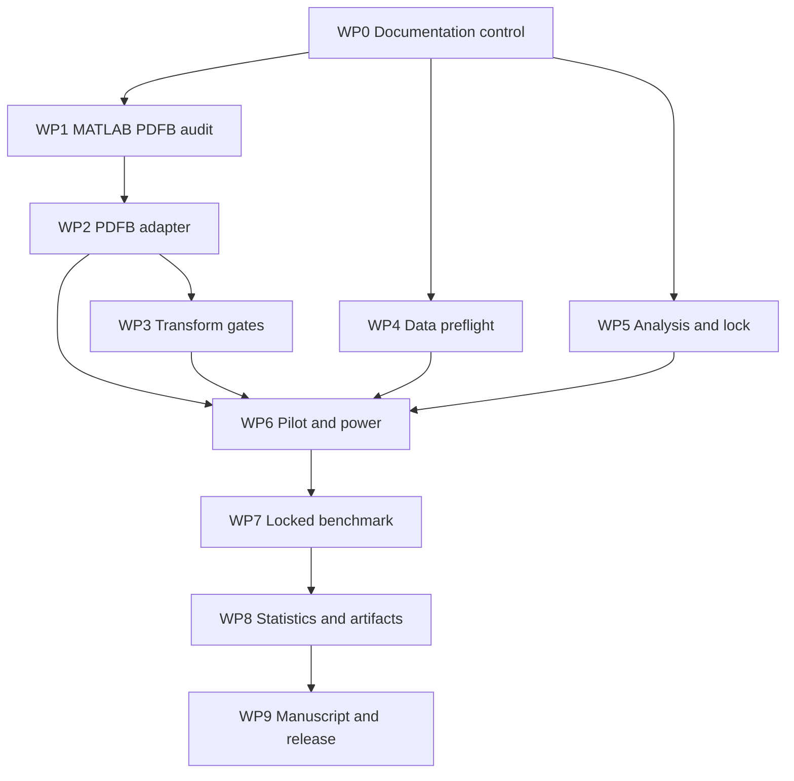

# Long-horizon development plan

## Purpose

This plan turns the research protocol into bounded software and evidence work
packages. Each package has dependencies, deliverables, acceptance criteria,
and stop conditions. A completed code path is not treated as completed
scientific evidence until its runtime gate also passes.

## Branch and review policy

- Keep P0 fixes, digital method work, data work, analysis work, and manuscript
  generation in separate branches or clearly scoped stacked pull requests.
- Default to draft pull requests.
- Stage only files belonging to the work package.
- Require unit tests, P0 freeze, documentation link validation, and CI.
- Never commit external MATLAB toolbox files or unauthorized datasets.
- Never overwrite evidence directories.
- Add outcome-determining changes to `DECISION_LOG.md`.
- Update `CLAIM_EVIDENCE_MATRIX.csv` when evidence status changes.

## Dependency graph

If the PDFB path fails, WP2 and contourlet-specific claims stop. WP4-WP9 may
continue as a clearly labelled Haar engineering study or controlled digital
factorial paper, subject to a revised claim boundary recorded before final
execution.

## WP0 - Documentation and governance

**Status:** implemented in the documentation branch.

### Deliverables

- documentation index;
- project charter;
- decision log;
- research protocol;
- data and split policy;
- claim/evidence matrix;
- experiment runbook;
- manuscript blueprint;
- release checklist;
- Persian master plan.

### Acceptance criteria

- all local links resolve;
- machine-readable CSV parses with unique IDs;
- numbers match executable constants;
- P0 and DIGITAL_A_D contracts are visibly separate;
- unsupported claims are marked pending, blocked, or prohibited;
- current implementation gaps are named.

## WP1 - External MATLAB PDFB runtime audit

**Tracking:** GitHub issue `#3`.

### Tasks

| ID | Task | Output |
|---|---|---|
| WP1.1 | Prepare MATLAB host and user-provided toolbox | environment inventory |
| WP1.2 | Generate and review `pdfb-plan` | execution plan JSON |
| WP1.3 | Run Stage-0 audit | raw evidence and logs |
| WP1.4 | Revalidate evidence independently | validation JSON |
| WP1.5 | Review band inventory and probes | signed review record |
| WP1.6 | Update claim matrix and gate status | documentation commit |

### Acceptance criteria

- runtime and toolbox identities are complete;
- resolved functions are inside the declared toolbox root;
- exact eligible structure contains enough slots;
- reconstruction and probe thresholds pass;
- raw aggregates are recomputed by Python;
- a human records approve or reject;
- no author-equivalence claim is made.

### Stop conditions

- fewer than 222,360 eligible coefficients;
- wrong number or identity of bands;
- reconstruction above tolerance;
- self-gain, cross-talk, or off-target probe failure;
- malformed or unverifiable evidence.

Negative evidence is the deliverable when a stop condition occurs.

## WP2 - Versioned PDFB embedding adapter

**Dependency:** approved WP1.

### Tasks

| ID | Task | Output |
|---|---|---|
| WP2.1 | Define external adapter protocol and serialization | adapter schema |
| WP2.2 | Bind transform identity to config and evidence hash | fingerprint contract |
| WP2.3 | Implement analysis and synthesis bridge | adapter module |
| WP2.4 | Implement eligible-band read/write mapping | canonical band mapper |
| WP2.5 | Add timeout, crash, and malformed-output handling | fail-closed runtime |
| WP2.6 | Add deterministic fixtures from approved evidence | tests |
| WP2.7 | Prevent use without matching Stage-0 approval | configuration gate |

### Acceptance criteria

- no shell command interpolation;
- external output is schema-validated;
- coefficient order and dtype are explicit;
- round-trip shape and reconstruction match Stage 0;
- band mapper writes exactly the intended coefficient;
- config refuses unapproved profile names or hashes;
- Haar and proxy behavior remains unchanged;
- toolbox is not vendored.

## WP3 - PDFB clean and pilot gates

**Dependency:** WP2.

### Tasks

1. generate deterministic transform audit through the adapter;
2. run coefficient-domain zero-BER tests;
3. run C0 clean embed-synthesize-analyze-extract at 45.0 dB;
4. run C1-C3 clean on development pairs;
5. run fixed pilot attacks;
6. record capacity, lambda, failures, and timing;
7. review the complete artifact package.

### Acceptance criteria

- every clean method decodes;
- PSNR target is not relaxed;
- every map has 222,360 unique slots;
- no hidden coefficient substitution occurs;
- repeated executions produce matching deterministic hashes where expected;
- stochastic outputs match recorded seeds;
- failures block later stages.

## WP4 - Data acquisition and preflight

### Tasks

| ID | Task | Output |
|---|---|---|
| WP4.1 | Select traceability and independent sources | source decision record |
| WP4.2 | Review licenses and redistribution limits | rights inventory |
| WP4.3 | Implement acquisition scripts | deterministic download/import path |
| WP4.4 | Implement source inventory | file and decoded hashes |
| WP4.5 | Implement exact duplicate detection | preflight report |
| WP4.6 | Implement perceptual near-duplicate review | candidate groups and decisions |
| WP4.7 | Implement split and seed completeness checks | manifest validator |
| WP4.8 | Generate calibration, pilot, traceability, and locked manifests | versioned CSV files |

### Acceptance criteria

- no content crosses split boundaries;
- all locked covers and secrets are unique unless a clustered design is
  prospectively approved;
- every final pair has seeds 2026-2030;
- paths resolve on a clean acquisition;
- licenses permit the documented use;
- only manifests, scripts, identifiers, hashes, and permitted fixtures enter
  Git.

## WP5 - Primary analysis and protocol-lock tooling

### Primary analysis tasks

1. parse `results_long.csv` with a strict schema;
2. select the nine final attacks and
   `effective_unrecovered_bit_rate`;
3. require C0 and C3 for every pair, seed, and attack;
4. average seeds within pair and attack;
5. average all nine attacks equally within pair;
6. calculate oriented `C0-C3`;
7. report mean, median, 95% paired bootstrap interval, sign-flip p-value,
   rank-biserial effect, and the 0.01 threshold decision;
8. retain pair-level values and missing-unit diagnostics;
9. generate CSV, JSON, and Markdown;
10. unit-test sign, weighting, duplicates, failures, and malformed inputs.

### Protocol-lock tasks

Create a command that records:

- source commit and clean state;
- format and config hashes;
- transform and approval hashes;
- stability artifact hash;
- manifests and source inventory hashes;
- attacks, metrics, benchmark, and analysis source hashes;
- seed set and sample-size decision;
- protocol and claim-matrix hashes;
- UTC lock time and lock ID.

### Acceptance criteria

- changing any locked input changes the lock ID;
- final execution refuses mismatched lock material;
- the primary decision is deterministic for fixed rows and seed;
- incomplete paired cells fail closed;
- synthetic fixtures cover positive, threshold-failing, inconclusive, mixed,
  and negative outcomes.

## WP6 - Calibration, pilot, and power

**Dependencies:** WP2 or approved control profile, WP4, and WP5.

### Tasks

1. calibrate transform stability from calibration split only;
2. run all four methods on the pilot split;
3. verify clean gate and artifact completeness;
4. estimate pair-level primary variance without inspecting locked data;
5. compute required sample size for 0.01 effect and at least 80% power;
6. choose `max(50, power requirement)`;
7. freeze final manifests and protocol lock;
8. archive pilot as non-final evidence.

### Acceptance criteria

- stability fingerprint matches final transform;
- pilot is never relabelled as final;
- power code and output are committed;
- no outcome-based attack, pair, or metric selection occurs;
- the final lock predates the final results.

## WP7 - Locked final benchmark

**Dependencies:** all WP1-WP6 gates required by the selected claim path.

### Execution

- use a clean checkout;
- create a new output directory;
- run C0-C3 for every locked pair and seed;
- run clean plus nine final attacks;
- retain every artifact and failure;
- generate a checksum inventory;
- copy evidence to two durable locations.

### Acceptance criteria

- every scheduled unit has an explicit status;
- operational failures are distinguished from decode failures;
- no result directory is overwritten;
- run material matches protocol lock;
- rerun decisions are versioned and affect the complete invalidated scope.

## WP8 - Statistics, tables, and figures

### Tasks

- run the primary aggregate analysis;
- run per-condition factorial analysis;
- verify multiplicity family;
- generate descriptive and worst-case summaries;
- generate manuscript tables T1-T10;
- generate original figures F1-F10;
- embed source hashes and generator versions;
- perform an independent numerical spot check.

### Acceptance criteria

- every number traces to a raw row;
- failures are visible;
- sample counts and intervals are shown;
- source-paper reported targets are distinguished;
- no manual spreadsheet value enters the manuscript;
- positive, neutral, mixed, and negative render paths are tested.

## WP9 - Manuscript and research release

### Tasks

1. complete the dated prior-art search and closest-method chart;
2. update claim matrix from final evidence;
3. draft the manuscript from `MANUSCRIPT_BLUEPRINT.md`;
4. select the correct result-dependent conclusion;
5. complete limitations, data/code availability, and threat boundary;
6. run the release checklist;
7. create an immutable source release;
8. archive evidence with a persistent identifier;
9. reproduce checksums from a fresh download;
10. submit only after a final claim audit.

### Acceptance criteria

- every strong claim is supported in the matrix;
- direct article language matches the achieved transform path;
- novelty language is bounded by the documented search;
- security wording does not exceed the threat model;
- code, manifests, evidence, and manuscript identify the same release.

## Test strategy

| Layer | Required tests |
|---|---|
| Unit | bit order, RS bounds, CRC, seeds, allocation, metrics, analysis signs |
| Contract | schema rejection, hash mismatch, nonempty output refusal, P0 freeze |
| Integration | clean C0-C3, attack determinism, calibration binding, benchmark outputs |
| External | MATLAB Stage 0, PDFB adapter round-trip, timeout and runtime failure |
| Scientific | paired-unit aggregation, primary threshold, multiplicity, failure inclusion |
| Reproduction | fresh install, data acquisition, lock verification, checksum regeneration |

## Risk register

| Risk | Impact | Mitigation |
|---|---|---|
| PDFB profile lacks capacity | Direct contourlet path blocked | Preserve negative evidence; limit claim scope |
| Coefficients are not independently writable | Clean decode fails | Stop adapter path; do not reduce payload |
| Licensed MATLAB is unavailable | Runtime gate delayed | Keep audit plan portable; use approved external host |
| Final dataset rights are unclear | Evidence cannot be shared | Select documented sources before lock |
| C3 overfits calibration attacks | Inflated result | Disjoint splits and nine-condition final suite |
| Repeated seeds inflate n | Invalid inference | Average seeds within pair |
| Decode failures disappear from BER | Survivor bias | Primary effective unrecovered-bit rate |
| Primary analysis is added after results | Researcher degrees of freedom | Implement and lock in WP5 |
| C3 is not superior | Original headline fails | Publish rigorous neutral/negative factorial result |
| Direct paper comparison is unfair | Invalid claim | Separate protocol or harmonize every contract |

## Immediate prioritized backlog

1. Execute and review GitHub issue `#3` on a MATLAB host.
2. Implement a machine-readable human PDFB review record.
3. Implement the versioned PDFB adapter only after approval.
4. Implement the attack-averaged primary analyzer.
5. Implement the protocol-lock artifact.
6. Implement data source inventory and duplicate/leakage preflight.
7. Select and document the independent dataset.
8. Add table/figure generation schemas.
9. Run PDFB clean gate and pilot.
10. Freeze calibration, power analysis, and final manifests.

No locked benchmark begins before items 1-8 required by the chosen claim path
are complete.
